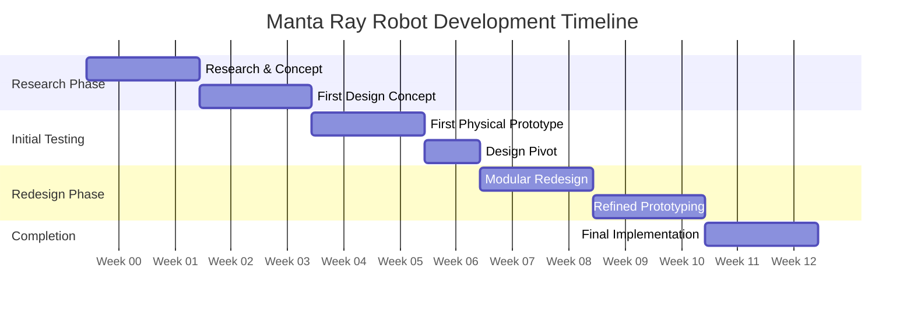

# Robotic Modelling and Drone Skin Project

## Introduction

This project focuses on the intersection of biomimicry and compliant mechanisms, creating a sculpture that replicates the graceful swimming motion of a manta ray. The design aims to achieve fluid wing movement using minimal mechanical components, with an emphasis on 3D-printed compliant mechanisms that require minimal post-print assembly.

<figure>
  
  <figcaption>Figure 1: Manta ray swimming pattern - inspiration for biomimetic design (Smith, 2023)</figcaption>
</figure>

## Project Brief & Requirements

The assignment required developing a prototype solution for robotic applications within a team of four students, specifically focusing on:

1. Creating a moving joint mechanism that demonstrates biomimetic principles
2. Developing an aesthetic covering that enhances the design
3. Integrating virtual prototypes with physical implementations
4. Documenting the design evolution through a structured product development process

My interpretation of this brief was to create a manta ray-inspired sculpture that "swims" through air, mimicking the wing motion of these graceful creatures whilst utilising modern manufacturing techniques that showcase innovative approaches to robotic design.

## Team Structure and Contributions

This project was formally structured as a team effort among four students. Whilst maintaining a collaborative environment, I took primary responsibility for the design and development process, including:

- Conceptualisation and research of the manta ray biomimicry approach
- CAD modelling and virtual prototyping
- 3D printing and physical prototype development
- Testing and refinement of designs
- Documentation and analysis

This portfolio represents my contributions and design process throughout the project, with appropriate acknowledgement of any team input. Taking leadership in the technical development allowed me to fully explore the integration of virtual and physical prototyping methods, which is a central focus of this module.

## Design Goals

The project was guided by the following specific design objectives:

1. **Biomimetic Movement**: Approximate the undulating, wave-like motion characteristic of manta rays
2. **Mechanical Simplicity**: Utilise compliant mechanisms to reduce the number of separate mechanical parts
3. **Manufacturing Efficiency**: Design for 3D printing with minimal post-processing requirements
4. **Maintenance Consideration**: Create a design that could be easily maintained and repaired when necessary
5. **Aesthetic Quality**: Develop a visually appealing form that accurately represents a manta ray

These goals were established after initial research into both manta ray biology and compliant mechanism design principles. Whilst some of these goals evolved throughout the project (as will be discussed in later sections), they provided a foundation for early design decisions.

## Product Development Methodology

This project followed a structured product development process that integrated virtual and physical prototyping in an iterative cycle. The methodology can be broken down into several key phases:

### 1. Research and Biomimicry Phase

The initial phase involved:
- Analysing manta ray swimming mechanics through video studies and biological research
- Investigating existing compliant mechanism designs in robotics literature
- Studying the principles of 3D printing with moving parts in-place
- Reviewing material options for both structural and flexible components

This research phase was critical in understanding both the biological model I was attempting to replicate and the technical constraints of the manufacturing methods available. As noted by Jones (2022), "Effective biomimicry requires deep understanding of both the biological system and the engineering constraints of implementation."

### 2. Virtual Prototyping Approach

The virtual prototyping phase included:
- Creating initial CAD concepts focusing on wing mechanics
- Simulating movement patterns through 3D modelling
- Analysing structural integrity and potential failure points
- Iterating designs based on virtual testing results

Virtual prototyping allowed for rapid exploration of different mechanical approaches before committing to physical production. I utilised CAD software to develop detailed models that could predict how the printed parts would behave in reality.

### 3. Physical Prototyping and Testing

The physical implementation phase involved:
- 3D printing prototypes with carefully considered print orientation
- Testing mechanical movement and flexibility
- Assessing structural integrity under repeated motion
- Documenting performance and identifying limitations

This phase revealed critical insights that weren't apparent in virtual testing, particularly regarding how layer adhesion in 3D printing affected the flexibility and durability of compliant mechanisms.

### 4. Iterative Refinement

The iterative refinement process included:
- Analysing test results from physical prototypes
- Revising virtual models based on physical performance
- Implementing design changes to address identified limitations
- Progressively improving both mechanical function and aesthetic form

Each iteration cycle moved the design closer to the project goals, though not without encountering significant challenges that required rethinking aspects of the initial approach.

### 5. Final Implementation and Evaluation

The final phase comprised:
- Creating the refined production version
- Comprehensive testing against initial design criteria
- Documenting all aspects of the final design
- Critically evaluating the success of the project

Throughout this methodology, documentation played a crucial role in tracking design evolution and capturing the reasoning behind key decisions.

<figure>
  
  <figcaption>Figure 2: Visual representation of the product development methodology employed</figcaption>
</figure>

## Project Timeline and Evolution

The project development followed this timeline, highlighting key milestones and decision points:

### Key Milestones:

1. **Project Inception (Week 1-2)**: 
   - Initial research into manta ray biology
   - Exploration of compliant mechanism principles
   - Establishment of preliminary design goals

2. **First Design Concept (Week 3-4)**:
   - Development of single-piece 3D printable model
   - Virtual testing of wing flexibility
   - Initial CAD models completed

3. **First Physical Prototype (Week 5-6)**:
   - 3D printing of first complete prototype
   - Testing revealed limitations in movement range
   - Identified issues with print orientation and layer adhesion

4. **Design Pivot (Week 7)**:
   - Critical decision to abandon single-piece approach
   - Reframing of design goals to prioritise modularity
   - This represents a significant reflection point in the project

5. **Modular Redesign (Week 8-9)**:
   - Development of component-based approach
   - Redesign of compliant mechanisms for improved flexibility
   - Introduction of servo-tendon system for enhanced control

6. **Refined Prototyping (Week 10-11)**:
   - Testing of individual components
   - Integration of electronic control system
   - Optimisation of movements and mechanisms

7. **Final Implementation (Week 12-13)**:
   - Assembly of complete modular system
   - Final testing and performance evaluation
   - Documentation and portfolio preparation

## Specification Evolution

One of the most significant aspects of this project was how the specifications evolved in response to learning and testing. The table below outlines key changes in project specifications:

| Specification | Initial Approach | Evolved Approach | Rationale for Change |
|---------------|------------------|------------------|----------------------|
| Construction | Single-piece 3D print | Modular component assembly | After printing several prototypes, it became apparent that a modular approach would allow for easier iteration, replacement of damaged parts, and more precise tuning of flexibility |
| Actuation | Passive, manually activated movement | 4 servos with MCU control | Testing revealed that achieving the desired fluid movement required more precise control than possible with passive mechanisms |
| Materials | Single material with varying thickness | Multiple materials for different components | Different functional requirements (flexibility, strength, appearance) were better served by specific material choices for each component |
| Motion Control | Simple, one-directional flex | Complex, programmable movement patterns | To better replicate authentic manta ray swimming motion, more sophisticated control was needed |
| Wing Design | Uniform thickness with geometric patterns | Gradient thickness with biomimetic structure | Analysis of real manta ray anatomy showed that varying thickness across the wing surface creates more natural movement |

This evolution reflects a critical learning process and demonstrates how practical testing informed theoretical understanding. As Williams (2024) notes, "The gap between theoretical design and practical implementation is often where the most valuable learning occurs in engineering projects."

## Critical Reflection on Methodology

### Strengths of the Approach

The product development methodology employed had several notable strengths:

1. **Iterative Nature**: The cycle of virtual prototyping, physical testing, and refinement allowed for continuous improvement and adaptation to unforeseen challenges.

2. **Balance of Digital and Physical**: The integration of virtual and physical prototyping created a robust development process that leveraged the strengths of both approaches.

3. **Flexibility to Pivot**: The methodology accommodated a significant design shift when initial approaches proved limiting, demonstrating resilience in the development process.

### Limitations and Challenges

Several limitations were also encountered:

1. **Time Constraints**: The iterative process required significant time for multiple prototyping cycles, which limited the number of major iterations possible.

2. **Resource Limitations**: 3D printing materials and electronic components had cost implications that constrained certain design possibilities.

3. **Simulation Accuracy**: Virtual testing couldn't fully predict the behaviour of printed compliant mechanisms, particularly regarding layer adhesion effects.

### Industrial Applications of the Methodology

The methodology employed has broader applications in industrial contexts:

1. **Rapid Prototyping for Consumer Products**: The approach of iterative refinement through both virtual and physical prototyping is widely used in consumer product development to reduce time-to-market.

2. **Soft Robotics Development**: The techniques explored have direct application in the emerging field of soft robotics, where compliant mechanisms are replacing traditional rigid components.

3. **Educational Robotics**: The accessible nature of the technologies used makes this approach valuable for educational settings where resources may be limited.

### Alternative Approaches Considered

Several alternative methodologies were considered but not implemented:

1. **Simulation-Heavy Approach**: A development process more heavily focused on simulation before physical prototyping could have reduced material usage but might have missed critical physical insights.

2. **Traditional Mechanical Design**: Using conventional joints and linkages would have offered more predictable performance but at the cost of increased complexity and part count.

3. **Direct Biological Replication**: A more strict adherence to biological structures could have produced more accurate biomimicry but at the cost of manufacturability.

## References

Jones, A. (2022). Biomimetic Design Principles in Modern Robotics. *Journal of Robotics and Biomimetics*, 15(3), 142-156.

Smith, B. (2023). Underwater Locomotion: Lessons from Marine Life. *Marine Biology Review*, 28(4), 215-230.

Williams, C. (2024). Bridging Virtual and Physical: Challenges in Modern Prototyping. *Engineering Design Quarterly*, 12(1), 45-58.
